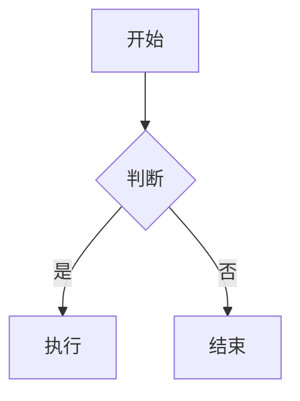

# Markdown（.md）文档使用细则

---

## 目录

- [1. 标题（Headings）](#1-标题headings)
- [2. 文本样式](#2-文本样式)
- [3. 列表](#3-列表)
- [4. 链接与图片](#4-链接与图片)
- [5. 代码](#5-代码)
- [6. 表格](#6-表格)
- [7. 引用](#7-引用)
- [8. 分割线](#8-分割线)
- [9. 任务列表](#9-任务列表)
- [10. 脚注](#10-脚注)
- [11. 转义字符](#11-转义字符)
- [12. 内嵌 HTML](#12-内嵌-html)
- [13. 目录生成](#13-目录生成)
- [14. 扩展语法（GFM）](#14-扩展语法gfm)
- [15. 实用技巧与规范](#15-实用技巧与规范)

---

## 1. 标题（Headings）

使用 `#` 号标记标题，共支持六级标题。

```markdown
# 一级标题
## 二级标题
### 三级标题
#### 四级标题
##### 五级标题
###### 六级标题
```

> **规范建议：**
> - `#` 与标题文字之间**建议加一个空格**（`# 标题` ✅ / `#标题` ⚠️ 部分解析器兼容但不规范）。
> - 标题后可以对称地加 `#`，纯属美观，不影响渲染：
>   ```markdown
>   ### 三级标题 ###
>   ```
> - 一级标题通常只用于文章大标题，正文内容从二级标题开始。
> - 标题下方可以用 `=`（一级）或 `-`（二级）替代 `#` 语法（Setext 风格）：
>   ```markdown
>   一级标题
>   ========
>   二级标题
>   --------
>   ```

---

## 2. 文本样式

| 语法 | 效果 |
|------|------|
| `**粗体**` 或 `__粗体__` | **粗体** |
| `*斜体*` 或 `_斜体_` | *斜体* |
| `***粗斜体***` 或 `___粗斜体___` | ***粗斜体*** |
| `~~删除线~~` | ~~删除线~~ |
| `==高亮==`（部分编辑器） | ==高亮== |
| `上标^test^`（部分编辑器） | 上标^test^ |
| `下标~test~`（部分编辑器） | 下标~test~ |
| `` `行内代码` `` | `行内代码` |

> **注意：**
> - 星号 `*` 和下划线 `_` 可互换，但建议统一使用星号，避免与单词中的下划线冲突。
> - 中文与标记符号之间**无需加空格**：`**粗体中文**` ✅。
> - 高亮 `== ==`、上下标 `^ ^` / `~ ~` 属于**扩展语法**，并非所有平台都支持（如 GitHub 不支持高亮）。

---

## 3. 列表

### 3.1 无序列表

使用 `-`、`*` 或 `+` 作为列表标记。

```markdown
- 项目一
- 项目二
- 项目三
```

> **建议：** 统一使用 `-`，避免混用不同符号。

### 3.2 有序列表

使用 `数字.` 开头，数字可以无序（解析器会自动递增）。

```markdown
1. 第一项
1. 第二项  （写成 1. 也会渲染为 2.）
3. 第三项
```

> **注意：** 如果列表项之间有空行，可能会导致列表被拆分为两个独立列表。

### 3.3 嵌套列表

子列表前缩进 **4 个空格**（或 1 个 Tab）。

```markdown
- 一级
    - 二级
        - 三级
```

### 3.4 列表项包含多段落/代码块

```markdown
1. 第一段文字。

    第二段文字（缩进 4 个空格或 1 个 Tab）。

    ```python
    print("代码块也需要缩进对齐")
    ```

2. 下一个列表项。
```

> **关键：** 多段落或代码块必须与列表标记的**起始文字对齐**（缩进 4 空格 + 列表标记宽度）。

---

## 4. 链接与图片

### 4.1 链接

**行内式：**
```markdown
[链接文字](https://example.com "可选的悬停标题")
```

**参考式（适合多次引用同一链接）：**
```markdown
[链接文字][ref_id]

[ref_id]: https://example.com "可选标题"
```

**自动链接：**
```markdown
<https://example.com>
<email@example.com>
```

### 4.2 图片

```markdown

```

- 图片路径可以是**相对路径**、**绝对路径**或 **URL**。
- 替代文字在图片无法加载时显示，也是无障碍访问的重要部分。

**图片带链接：**
```markdown
[](目标链接)
```

> **💡 技巧：** 在 GitHub / GitLab 等平台，可通过拖拽图片到编辑器自动生成图片语法。

---

## 5. 代码

### 5.1 行内代码

用单个反引号包裹：

```markdown
使用 `printf()` 函数输出内容。
```

如需在行内代码中显示反引号，使用双反引号包裹：

```markdown
`` 代码中含有 ` 反引号 ``
```

### 5.2 代码块

````markdown
```语言名称
代码内容
```
````

常用语言标识：

| 语言 | 标识 |
|------|------|
| Python | `python` / `py` |
| JavaScript | `javascript` / `js` |
| TypeScript | `typescript` / `ts` |
| Java | `java` |
| C / C++ | `c` / `cpp` |
| HTML | `html` |
| CSS | `css` |
| Shell/Bash | `bash` / `shell` / `sh` |
| JSON | `json` |
| YAML | `yaml` / `yml` |
| Markdown | `markdown` / `md` |
| SQL | `sql` |
| 纯文本 | `text` / 不写 |

### 5.3 转义代码块内的反引号

如果代码块内容包含三个连续反引号，可以使用更多数量的反引号作为定界符：

`````markdown
````markdown
```python
print("Hello")
```
````
`````

---

## 6. 表格

```markdown
| 左对齐 | 居中对齐 | 右对齐 |
|:-------|:--------:|-------:|
| 内容   | 内容     | 内容   |
| 数据   | 数据     | 数据   |
```

| 对齐方式 | 语法 |
|----------|------|
| 左对齐 | `:---` |
| 居中对齐 | `:---:` |
| 右对齐 | `---:` |

> **注意：**
> - 表头和分隔行是**必须**的（分隔行：`|---|---|`）。
> - 管道符 `|` 两侧的空格可选，但**建议加上**以提高可读性。
> - 可以在表格中使用行内样式：`**粗体**`、`*斜体*`、`` `代码` `` 等。
> - 部分编辑器支持在表格中插入链接、图片。

**表格内转义管道符：** 使用 `|` 或 `\|`。

---

## 7. 引用

```markdown
> 这是第一层引用
>
> > 这是嵌套的第二层引用
> >
> > 第二层内容
>
> 回到第一层
```

> **技巧：**
> - 引用中可以使用任何 Markdown 语法（标题、列表、代码等）。
> - `>` 后建议加一个空格：`> 内容`。

---

## 8. 分割线

三种写法等价：

```markdown
---
***
___
```

> **规范：**
> - 使用三个或以上符号。
> - 行内不能有其他内容。
> - 建议在分割线上下各留一个空行，避免被误解析为标题（`---` 紧接文字上方会被解析为二级标题）。
> - **推荐统一使用 `---`**。

---

## 9. 任务列表

```markdown
- [ ] 未完成的任务
- [x] 已完成的任务
- [ ] 待办事项
```

> **注意：**
> - 方括号内必须是**小写** `x`（`[X]` 部分平台兼容，但 `[x]` 是标准）。
> - `[ ]` 中间必须有一个空格。
> - 这是 **GFM（GitHub Flavored Markdown）** 扩展语法。

---

## 10. 脚注

```markdown
这是一个带有脚注的句子。[^1]

[^1]: 这是脚注的内容。
```

> **注意：**
> - 脚注属于扩展语法，并非所有平台支持。
> - 脚注的标识可以是数字或文字：`[^note1]`。
> - 脚注定义可以在文档任意位置，最终会渲染到文末。

---

## 11. 转义字符

使用反斜杠 `\` 转义 Markdown 特殊字符：

```markdown
\* 这不是斜体 \*
\# 这不是标题
\` 这不是代码
```

需要转义的字符：

| 字符 | 说明 |
|------|------|
| `\` | 反斜杠本身 |
| `` ` `` | 反引号 |
| `*` | 星号 |
| `_` | 下划线 |
| `{}` | 花括号 |
| `[]` | 方括号 |
| `()` | 圆括号 |
| `#` | 井号 |
| `+` | 加号 |
| `-` | 减号/连字符 |
| `.` | 句点 |
| `!` | 感叹号 |
| `|` | 管道符 |

---

## 12. 内嵌 HTML

Markdown 支持直接嵌入 HTML 标签：

```markdown
<div align="center">

**这段文字会居中显示**

</div>

<details>
<summary>点击展开详情</summary>

折叠的内容在这里。

</details>

<kbd>Ctrl</kbd> + <kbd>C</kbd>
```

**常用场景：**
- 文字居中、右对齐
- 图片尺寸控制：``
- 折叠面板（`<details>`）
- 键盘按键样式（`<kbd>`）
- 下划线 `<u>`、注释 `<!-- -->`

> **注意：** HTML 块级标签前后需空行；行内 HTML 可在任意位置使用。GitHub 等平台为安全考虑，会过滤部分 HTML 标签（如 `<script>`、`<style>`）。

---

## 13. 目录生成

部分平台（GitHub、GitLab、VS Code 等）支持通过 `[TOC]` 或特定语法自动生成目录。

**手动创建目录（兼容性最好）：**

```markdown
- [章节一](#章节一)
- [章节二](#章节二)
  - [子章节](#子章节)
```

**锚点规则：**
- 中文标题的锚点通常为标题文本的 URL 编码形式。
- 英文标题：大写 → 小写，空格 → 连字符 `-`，移除标点。
- 示例：`## Hello World!` → `#hello-world`。

---

## 14. 扩展语法（GFM）

GitHub Flavored Markdown 提供以下扩展：

### 14.1 表格
（见第 6 节）

### 14.2 任务列表
（见第 9 节）

### 14.3 删除线
`~~删除内容~~`

### 14.4 自动链接
URL 会自动转为可点击链接。

### 14.5 提及（Mention）
- GitHub 用户：`@username`
- Issue/PR 引用：`#123`、`org/repo#123`
- Commit SHA：`a1b2c3d`

### 14.6 Emoji
```markdown
:smile: :+1: :tada: :rocket:
```
😄 👍 🎉 🚀

### 14.7 数学公式（部分平台支持）
```markdown
行内公式：$E = mc^2$

块级公式：
$$
\int_a^b f(x) \, dx
$$
```

### 14.8 Mermaid 图表（部分平台支持）
````markdown

````

---

## 15. 实用技巧与规范

### 15.1 空白与换行

| 方式 | 写法 |
|------|------|
| 段落内强制换行 | 行末加 **两个空格** 再回车 |
| 段落间分隔 | 中间空一行（连续两个回车） |
| 硬换行（部分编辑器） | 使用 `<br>` 标签 |

> **推荐：** 段落间空一行；段落内尽量不换行，或使用 `<br>`。

### 15.2 文件命名

- 使用 `.md` 或 `.markdown` 扩展名。
- 推荐 `.md`（更通用）。
- 文件名建议使用英文或拼音，避免特殊字符。
- `README.md` 会被 GitHub 等平台自动渲染为项目首页。

### 15.3 常见错误与避坑

| 问题 | 原因 | 解决 |
|------|------|------|
| 列表中断 | 列表项之间插入了未缩进的内容 | 保证同属一个段落的缩进一致 |
| `---` 变成标题 | `---` 紧接文字上方 | `---` 上下各空一行 |
| 代码块不显示高亮 | 语言标识不识别 | 确认语言别名是否正确 |
| 表格渲染异常 | 分隔行格式不对 | 分隔行每列至少三个 `-` |
| 嵌套列表错乱 | 缩进不是 4 个空格 | 统一用 4 空格缩进 |
| 链接不跳转 | 中文锚点编码问题 | 去除标点，空格转 `-` |

### 15.4 编辑器推荐

| 编辑器 | 特点 |
|--------|------|
| **VS Code** | 免费、插件丰富、实时预览 |
| **Typora** | 所见即所得，简洁优雅 |
| **Obsidian** | 双向链接、知识管理 |
| **Notion** | 在线协作、数据库集成 |
| **GitHub 网页端** | 直接编辑预览 |

### 15.5 书写规范

1. **标题层级合理**：一级标题（`#`）仅用于文档大标题，正文从 `##` 开始。
2. **中英文混排**：中英文之间建议加一个空格（`使用 Python 开发` ✅）。
3. **链接有描述**：避免裸链接，使用有意义的链接文字。
4. **图片有替代文字**：`` 中的描述尽量清晰。
5. **代码标明语言**：代码块始终标注语言以获得语法高亮。
6. **文末留空行**：文件以空行结尾（POSIX 规范，避免某些工具警告）。
7. **每行不超过 120 字符**：方便版本控制和代码审查 diff。

---

## 附录：速查表

| 元素 | 语法 |
|------|------|
| 标题 | `# H1` `## H2` `### H3` |
| 粗体 | `**text**` |
| 斜体 | `*text*` |
| 粗斜体 | `***text***` |
| 删除线 | `~~text~~` |
| 行内代码 | `` `code` `` |
| 代码块 | ```` ```lang\ncode\n``` ```` |
| 链接 | `[text](url)` |
| 图片 | `` |
| 无序列表 | `- item` |
| 有序列表 | `1. item` |
| 引用 | `> quote` |
| 分割线 | `---` |
| 表格 | `\| col \| col \|` + `\|-\|- \|` |
| 任务列表 | `- [ ] task` / `- [x] done` |
| 脚注 | `[^id]` + `[^id]: text` |
| 转义 | `\*literal\*` |

---

> **最后更新：** 2026-07-31
>
> **参考资料：** [CommonMark Spec](https://commonmark.org/) · [GitHub Flavored Markdown Spec](https://github.github.com/gfm/)